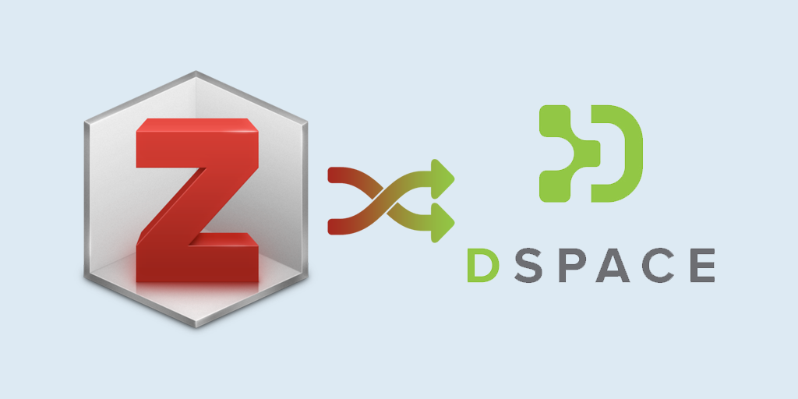

# Zotero-to-DSpace
A tool to migrate Zotero metadata to DSpace. It converts Zotero-CSV to DSpace-CSV format. 

Usage example: It is used to migrate data from Zotero to UCY's institutional repository (https://gnosis.library.ucy.ac.cy/)

$ ./convert.py -i input.csv -o a_filename.csv -ao
Found records: 389
 37%|█                                                                       | 143/389 [00:03<00:06, 39.47it/s]

##### License: CC BY-NC-SA 4.0 (https://creativecommons.org/licenses/by-nc-sa/4.0/)


Using:
- langid 1.1.6
- numpy 1.16.2
- python-stdnum 1.11
- PyYAML 5.1
- tqdm 4.31.1

## Getting Started

These instructions will install requirements and allow you to execute the code.

### Prerequisites
(Optional) Create a virtual environment to install

### Configuring your project

- Install requirements
```
pip install -r requirements.txt
```

- To view usage instructions use the command ```./convert.py -h```:
```
$ ./convert.py -h
usage: convert.py [-h] [-i INPUT_FILE] [-o OUTPUT_FILE] [-hdl HANDLE] [-ao]

This is a script to convert Zotero CSV export to DSpace CSV format.

optional arguments:
  -h, --help            show this help message and exit
  -i INPUT_FILE, --input-file INPUT_FILE
                        This is the filename of the input csv file from
                        Zotero. If none is specified, input.csv is used.
  -o OUTPUT_FILE, --output-file OUTPUT_FILE
                        This is the filename of the generated csv file (to be
                        imported to DSpace). If none is specified, output.csv
                        is used.
  -hdl HANDLE, --handle HANDLE
                        This is the collection handle (target collection) If
                        none is specified, 7/1234 is used.
  -ao, --add_orcids     Add ORCiDs from file. It loads ORCiDs from
                        ./settings/orcid.csv. This CSV file includes 3 columns
                        (surname, name, ORCiD).

```
- Place a Zotero CSV file in the same directory as convert.py

- Convert to DSpace CSV format using the command:
```
./convert [-i INPUT_FILE] [-o OUTPUT_FILE] [-hdl HANDLE] [-ao]
```
    
###### Note 1: If no input file is declared with -i, input.csv is assumed.
###### Note 2: If no output file is declared with -o, output.csv is assumed.
###### Note 3: If no handle is declared with -hdl, 7/1234 is assumed.
###### Note 4: An additional custom metadata value can be added by using the -ao option. This is optional and a custom implementation.

## Configuration
- Set the equivalent of Zotero language in ISO format in ```languages_zotero.csv```. This is used to generate dc.language.iso
- Set the header of the generate DSpace CSV file using values in ```dspace_csv_header.yml```.
The file comprises of 3 sections:
    1. ```initial_fieldnames``` are header values that always exist. Note that ```dc.type.uhtype``` is a custom field used at gnosis.ucy.ac.cy, to store item type. In your case you could copy values in ```dc.type``` and delete this column.
    2. ```fieldnames_with_language``` are fields that have a language value, for example ```dc.title[el]``` or ```dc.title[en]```.
    3. ```fieldnames_with_no_language``` are fields (headers) without language destinction, for example ```dc.source.uri[]```.
- Set metadata mapping in ```metadata_mapping.yml```. In it are 2 main groups of settings:
    1. ```metadata_with_language```. These are fields that should have their language detected. For example if a title in in english, it should be set in ```dc.title[en]``` column. If a title in in greek, it should be set in ```dc.title[el]``` column.
    2. ```metadata_without_language```. These are fields that should not have their language detected. For example ```dc.source.uri[]``` column.    
    - On the left you have the DC field.
    - On the right you have the column number of Zotero's CSV file. CAUTION: numbering starts at zero (0)!
- Set type translation in ```types.yml```. This configuration file allows to translate a Zotero type to a "friendlier" value in case you need to index it and present it to the end-user.
